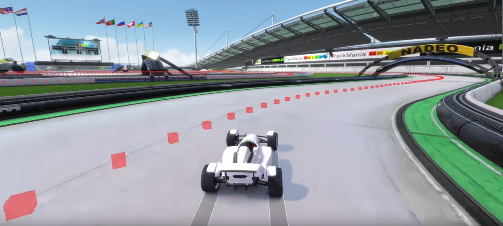

# `tracks` Folder Overview

The `tracks` folder contains all the maps used for training, along with their associated reference lines.

> !!! **Important**: Although maps are listed here, to actually play them in-game, they must be placed in your `../TmForever/Tracks/Challenges` directory.

---

## Reference Line

The concept of the reference line comes from the [linesight_rl project](https://github.com/Linesight-RL/linesight).  
It defines a trajectory along which the agent’s progress is measured.
Reference lines consist of points sampled every **50 cm** along the path
driven in a replay. To generate a reference line for your map, follow these steps:

1. **Drive the map** manually to the finish line and save the replay.
   - By default, replays are saved in:  
     `../TmForever/Tracks/Replays/`

2. **Convert the replay to a reference line file** using:

   ```bash
   python tracks/refline/create_refline/gbx_to_vcp.py {path_to_replay}.Replay.Gbx
   ```
   This will create a `.npy` file under  `tracks/reference_line`

3. **Visualizing the Reference Line** 

    To verify the placement of the reference line on your map:

    1. Launch the game with the map that the reference line was created on, via TMInterface.
        You can use the default port or specify a custom one.
    2. Once the map is loaded, run the following script to visualize the reference line:   
    ```bash
    python tracks/refline/create_refline/add_vcp_as_triggers.py {path_to_reference_line}.npy -p {port_number}
    ```
    3. You should now see the reference line visualized in-game as a trail of boxes, as shown in the image below.
    <p align="center">
    
    <br/>
    <em>Figure 1: Reference line shown as a trail of trigger boxes in-game.
    Source: 
        <a href="https://linesight-rl.github.io/linesight/build/html/second_training.html#define-a-reference-line" target="_blank">Linesight documentation
    </a> 
    </em>
    </p>
    
    > If the boxes do not appear, check the TMInterface settings and ensure that triggers are enabled/visible in the menu.

