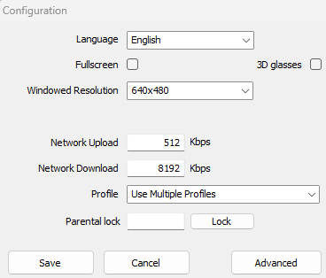

# Installation

## Prerequisites

- Python >= 3.10
- Pytorch >= 2.1
    - If you want to train on GPU you also need CUDA, check the official [PyTorch Website](https://pytorch.org/get-started/locally/)
- [Trackmania Nations Forever](https://store.steampowered.com/app/11020/TrackMania_Nations_Forever/)
- [TrackMania ModLoader](https://tomashu.dev/software/tmloader/), also referred to as TMLoader
    - [TMInterface](https://www.donadigo.com/tminterface/) for communication with the game

### Resources
To run this repostiroy, you can get away with using an okey-laptop. However, if you plan on seriously training agents we recommend at least a RTX3060 with >= 12 GB of VRAM
and at least 16 GB RAM (this is probably enough for on-policy, but if you plan on using a replay-buffer, you will need much more). We trained agents successfully on 32 GB of 
RAM using PPO (on-policy), but for off-policy we had 64 GB of ram.

## Project Installation

Clone the repository and check that you have fulfilled all Prerequisits. This repository is [uv](https://docs.astral.sh/uv/) managed. To get started call `uv sync`.

### Platform-CFG

Before starting up the code, create a `platforms.yaml`, containing the operating system, the device and paths to angel-script plugin as well as TM-Forever folder;

```yaml
platforms:
  os: windows / linux                             # operating system
  tmloader: .../TMLoader/TMLoader.exe             # path to tmloader-executable
  plugin: .../TMInterface/Plugins/python_link.as  # path to plugin
  map_dir: .../TmForever/Tracks/Challenges        # path to challenges folder
  device: cuda / cpu                              # device; either cpu or cuda
  wineprefix : /home/..../TMNF                    # Optional argument for linux users, if wine is installed in a speciifc prefix
```
The default location for this file is in `configs/platforms.yaml`, but you can chance this by changing the `platforms_config_path` attribute of `configs/train.yaml` file to the desired path.

### Plugin `python_link.as`
The plugin provided by TMInterface is completely fine, yet we made some modifications (Donadigo provided these changes). For example, when reloading maps during training, the unedited plugin sometimes leads to the agent not responding when the window is not in focus, which causes the training to crash. Therefore, it is not mandatory, but we recommend
you use the plugin provided in `game_intertaction/plugin/python_link.as`.

### If on Linux

You need to make sure you have wine and winetricks installed, as this is necessary to translate windows-based systemcalls into linux-based systemcalls (in order to be able to execute the game TMNF):
```sh
sudo apt install winetricks
winetricks dxvk
```
You also have to have build-tools installed, i.e.
```
sudo apt install xdotool libxdo-dev
```
To be quite fair, i hope you figure it out to make the game run; it took me some time as i had no idea how wine works, but there are a lot of great tutorials.

## Game-Setup

This is optional, but in order for your game not to be on full-screen the whole time, you need to launch the game, as if you'd want to play it and click on `configure` (as of 2025, this button is to the right of the play button). And then set your settings (i.e. winodw-resolution) as you'd like; just unclick fullscreen.
<center>
    
</center>

### Does everything work?
If you have installed everythingh correctly and placed he platform-cfg into the right location, then you should be able to execute the scripts. Try one of the scripts in `scripts/tests`, for example manual-stepping:
```sh
python scripts/tests/manual_stepping.py
```