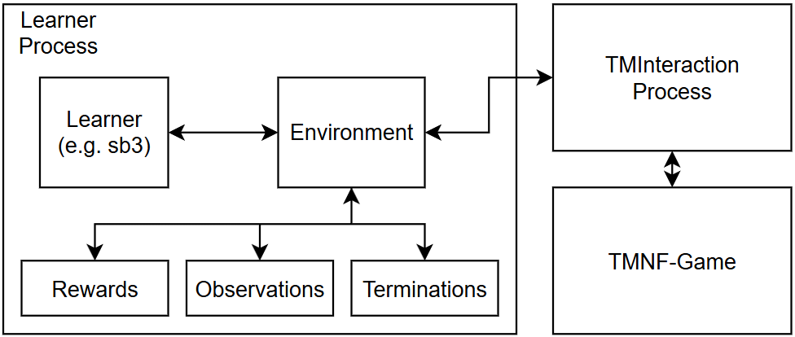

# Project Structure

The two main things to understand when using this project is how the game-interaction works, and how the environment is structured. A high-level overview of how all components work together is given in this image:

{ width="400", .center }

The learner process consists of a learner (most likely a RL-Library like sb3) and the environment. The learner is what steps the environment, i.e. calls the `step`-method. The environment then sends IPC (Inter-Process-Communication) commands to the TMInteraction Process. This process continuously communicates with the plugin provided by TMInteraction via a TCP-Connection.

This architecture was chosen in order to completely de-couple the environment from the necessary continuous communication with the game. This enables the environment to only send and receive on-demand.

## Environment

The environment is implemented as a Gymnasium-Envioronment. For an in depth tutorial on how to create environment instances see [here](https://gymnasium.farama.org/tutorials/gymnasium_basics/environment_creation/). 

We chose a task-based manager architecture, where we employ managers to calculate Rewards, Observations and Terminations. Under the hood, the main task of the environment is to send actions to the TMInteraction-Process and gather raw-observations (images and game-states). Each manager, i.e. Reward-, Observation- and Termination-Manager has access to these raw-observations.

In this project, multiple versions of an environment are implemented. The main one that is talked about in this article is `trackmania_env.envs.single_agent_env2.TMNF_Single_Agent_Env`. Other environments that are implemented use this environment. Other environments include:

 - `envs.sec_env.CrashProofEnvironment` this is just a wrapper for the original environment, as we sometimes had problems with the game not resetting after the agent reached the finish-line. This led to crashes during trainings. This wrapper-environment catches these crashes and restarts the whole pipeline. We mainly use this environment.
 - `vectorized.VectorizedTMEnvironment` is a vectorized version of the environment. It stores the environments and exposes a batched interface.
 - `vectorized.SB3Vectorized` is a wrapper-environment for `VectorizedTMEnvironment` that is compatilble with stable-baselines3. This is used in `scripts/sb3_train_vectoried`.


### Order of Operations
The order of operations in the environment in the step-method.

1. Send `step`-command to the Process-Wrapper
2. Advance the reference line
3. Calculate Terminations
4. Calculate Observations
5. Calculate Rewards


### Vectorized Environment

We also implemented a vectorized version of the environment, which allows you to collect rollouts from multiple game-instances at the same time, speeding up training time. Training with a vectorized environment and stable-baselines3 is implemented in 
```sh
python scripts/sb3_train_vectorized.py
```
A script for testing and manual inputs to the environment is implemented in 
```
python scripts/tests/step_vectorized.py
```

#### Spaces
The vectorized environment expects action in the shape of `(N,)`, returns rewards and terminations in the same shape, if `N` is the number of environments. The info returned by the vecroized is a list with `N` entries, one for each environment. The shape of vectorized observations are documented with the [observataion-manager](managers.md#vectorized-observations).

#### Resources
For each environment, a new game-instances is spawned. Therefore you have to test how many environments your system can handle. On a system using 32 GB of Ram and a 5070 TI (16GB VRAM) 5 environments seem to work fine.

#### Multiple tracks
The vectorized environment also supports the stepping on multiple tracks, i.e. you can pass 10 track but only spawn 5 environmetns, in order to diversify your domain.


## Process-Wrapper `game_interaction.process_wrapper.TMIProcessWrapper`
The main task of this class is to continuously respond to TCP-Messages sent by the TMInterface Plugin, such that the connection never fails. The envionrment communicates with the ProcessWrapper by sending commands via a Multiprocessing-Queue and the Process-Wrapper answers the environments-requests also via a Multiprocessing-Queue.

!!! note
    The description of the prcess wrapper has to be technical, and if you do not plan on modifying the environment or how Trackmania-Gym Interacts with the game you will most likely not need to know this.

### Start of the Process
This is the encapsulated way of starting the ProcessWrapper. This method starts the Game and ProcessWrapper and waits for a Connected-Signal from the ProcessWrapper. I.e. once this method returns, control- and response-queues can immediately be used.
```py
# instanciation of process-wrapper
from game_interaction.run_multiprocess_wrapper import start_process_and_wait_for_startsignal
p, control_queue, response_queue = start_process_and_wait_for_startsignal(...)
``` 
`p` is the process-object, the `control_queue` is what is used to send commands to the ProcessWrapper and `response_queue` is where the answer can be expected. 

### ICP-Commands
These are the available commands that the process wrapper can respond to. In this example, a step-command is sent with command id 10 (this is not relevant really).
```py
from game_interaction.ipc_fields import IPCFields, IPCCommands
# send command
cmd = IPCCommands.step(10, action)
command_queue.put_nowait(cmd)

# get response and handle accordinlgy.
response = response_queue.get(timeout=timeout)
assert response[IPCFields.CMD_ID] == cmd_id
if response[IPCFields.STATUS] == IPCFields.STATUS_OK:
    pass # everything worked
elif response[IPCFields.STATUS] == IPCFields.STATUS_ERROR:
    errormsg = response[IPCFields.ERROR] # get error
```

Depending on what command was sent, the respons-object, which is a dictionary may contain different keys. All keys the response-object may contain, if any additionally to STATUS are specified in `IPCFields`.


### Waitforstep

Waitforstep-Mode is one of the most important features of the ProcessWrapper, as it directly supports the desired MDP behaviour of the RL environment. This mode can be activated using the `waitforstep`-command. After this mode has been activated, the ProcessWrapper expects `step` commands.

The main purpose of this mode is to ensure equal timing between `step`-calls, i.e. equal timing between actions in the environment. You do not have to worry about sending the `step` commands quickly enough, rather this delay is taken care of by resetting the game-state. Without this mode, the amount of in-game-steps between each environment-step are unknwon and your agent may not learn anything as the distance between two environment steps is too far apart.

Basically this mode allows the implementation of `actions_per_second` and actually match these seconds to in-game-seconds.

#### Policy Updates
When the policy updates the waiting time between environment-steps may significantly increase; as the learner process is busy doing backpropagation. This is handled by the process wrapper by disengaging the waiting for a step-command and stopping the current action of the agent. Once the learner is done and starts sending step-commands again, the ProcessWrapper automatically resumes Waitforstep-Mode.


## Modules 
A high-level description of all top-level modules

- `configs` - Contains all configuration files
- `game_interaction` - Everything necessary for the communication with TMNF
- `neural_networks` - Contains Neural Networks, Feature Extractors, Learning-Rate Schedulers
- `plotting` - Our plotting framework necessary for testing and live-visualizations
- `scirpts` - Training and testing executables
- `trackmania_env` - Everything around the trackmania-environment
```
trackmania_env
├── envs
│   ├── single_agent_env.py
│   └── testenv_single_agent.py
├── observations
│    └── observation_manager.py
|    └── implementations (contains all implemented observation-managers)
│        ...
├── rewards
│   └── reward_calculation.py
|   └── implementations (contains all implemented reward-managers)
│       ...
└── utils
    ├── position_buffer.py
    └── reference_line_manager.py
        ....
```

`trackmania_env.utils` contains standalone classes or methods that are either used by the enviornmenr, reward or observation-managers.
- `tmn_sb3` - Utilities necessary for the interaction with stable-baselines 3
- `tracks` - Track-files (`.Gbx`) we use for trainings and their corresponding reference lines