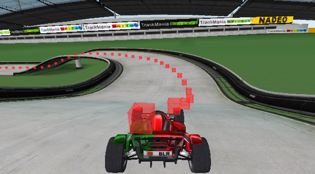

# Measure of Progress
Similar to other projects, we also use a reference-line along the track in order to measure the progress of the agent (car) algon the track. The main reason for this is because there is no built-in measure.

## ReferenceLineManager

The `trackmania_env.utils.reference_line_manager.ReferenceLineManager` is one of the most important managers of the environment, as it keeps track of the progress of the car. Once per environment-step, the refline-manager is given the current position of the car and then calculates the next-reference-line points and the distance to the next-reference-line point.


### Methods
- `calculate_and_step_next_point()` - DO NOT USE this, this is called by the environment

TODO

#### Example Usage

```py
# i is the index of the next point
i, d, drel = self.env.reference_line.get_distance_to_next_point()
```

## Visualize it
Its important to validate the reference line before training; best and basically only way is to visualize it.

### In-Game
Start the game using the modloader TMLoader. Then execute
```sh
python tracks\reference_line\create_refline\add_vcp_as_triggers.py tracks/reference_line/Level1.npy
``` 
which should then look something like this
<center>
    <br>
    This picture is from the map simple1_validated.
</center>

### Matplotlib
Use `tracks.reference_line.plot.py`, which is a quick-and-dirty script to quickly visualize the reference line as a 3D Plot in matplotlib. The script assumes the reference line is stored in `tracks/reference_line` as a numpy-file. When in base-directory of the repository execute:

```sh
python .\tracks\reference_line\plot.py Level1.npy #or any other Refline
```


## Create your own
When introducing a new map to the learning setup or just wanting a reference line that is not in the center, its necessary to create your own. Follow these steps:

 1. Start TMNF using TMloader and load the map for which you want to create a reference line
 2. Drive the reference line you desire (it does not matter how fast you drive, you can take your time)
 3. Save the replay
 4. Execute `python tracks/reference_line/create_refline/gbx_to_vcp.py [path_to_your_replay] [path_to_npy-file]`
 5. The `.npy` file is your reference-line
 6. Make sure to inspect it in order to check if everything is as you please!

### Saving Convention 
In this repository, we always name the reference-line-file EXACTLY as the track-file. So if your track is called `abc.Challenge.Gbx` your refernce-line should be called `abc.npy`. This is important, as the Reference-Line-Manager loads the reference-line dynamically and is only given the track name.

Also save your reference line in the reference_line directory, as it is expected here.