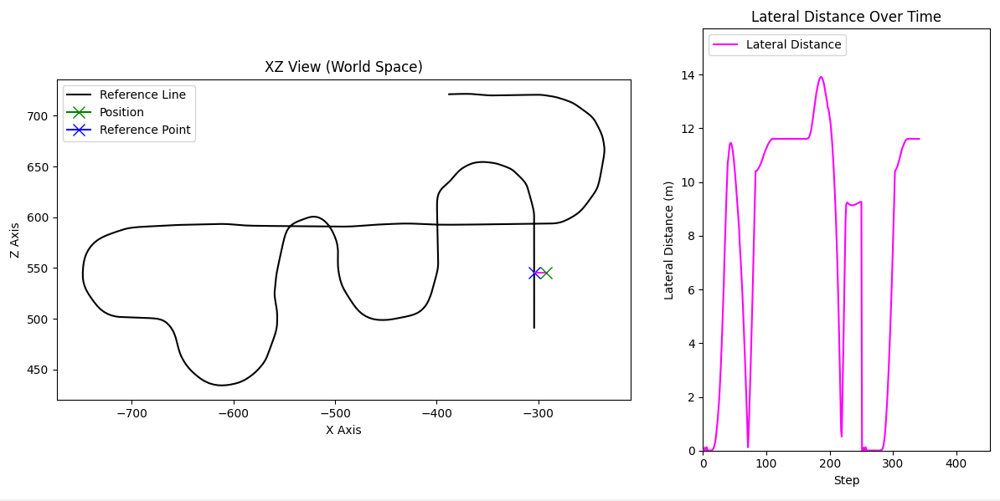

# Live-Testing

You can live-test your rewards, observations and terminations using our testing-interface. We built an environment which you can step using key-inputs as action commands. You can just use the arrow-keys `UP`, `DOWN`, `LEFT`, `RIGHT` to drive the car as you would in-game. `ESC` terminates the execution and `SHIFT` resets the plotting terms (although this is still being worked on currently). Live testing allows you to see directly how your terms react. 

## Execution 

```sh
python .\scripts\tests\manuel_stepping.py 
```

### Example plot
This for example is the live plot of the reference line, the current position of the agent (green X), the current  reference line point (blue X) and the lateral distance at each environment step.


{ width="400", .center }


## Customize plots

Go into the file `manuel_stepping.py` and add/remove whatever plot you want. A bunch of plots we regularly use are commented in there, so you can just un-comment them or comment the ones you do not want to see. 

!!! note
    We are still working on better defining the information that is given by the enviornment, currently this is quite a messy conglomerate of dictionaries. Once this is done we will add a tutorial on how to create custom plots; for now you have to rely on your coding skills to figure it out. The code is not too messy though.


## Specific Plots

### Testing the Reward Function
Most useful plots for testing the reward function
```py
# Plots the reward function on the y-axis and environment steps on the x-axis; also plots the individual terms.
tm_env.add_env_test_calback(plot_callback.Plot_Rewards_Callback(env = tm_env))
# Prints the reward and terms directly to the console (Guaranteed without delay)
tm_env.add_env_test_calback(print_callback.PrintRewardsToConsole())
```